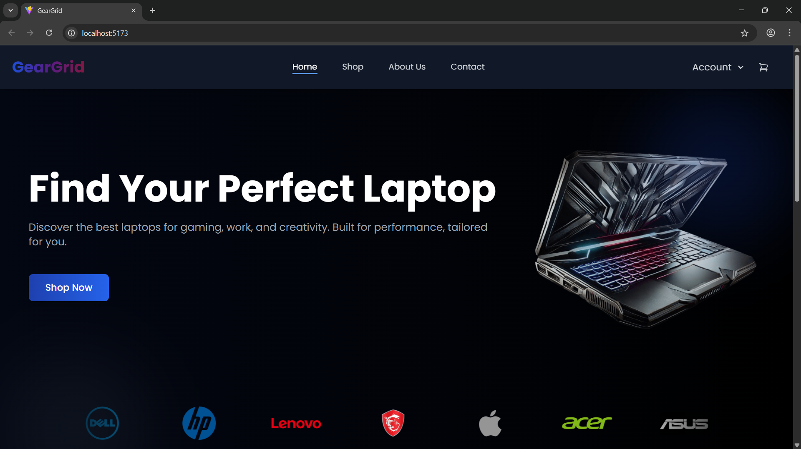
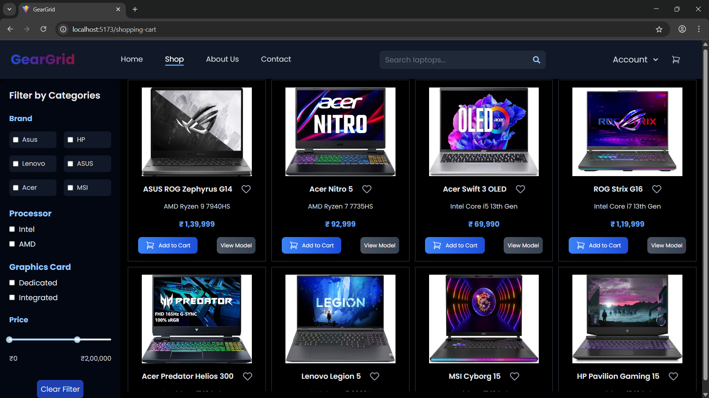
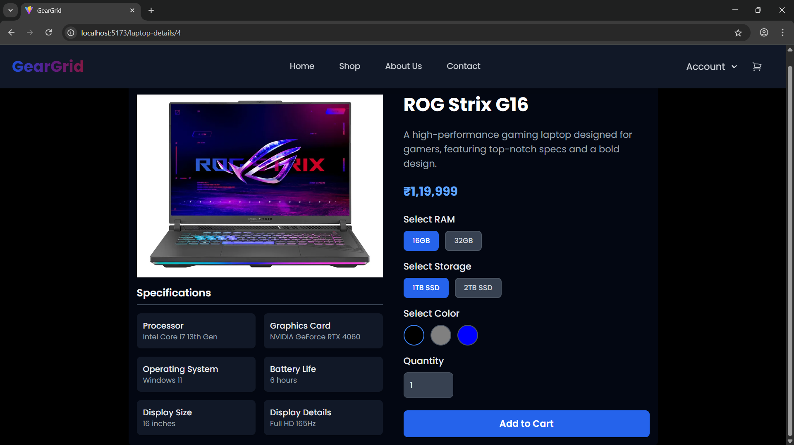
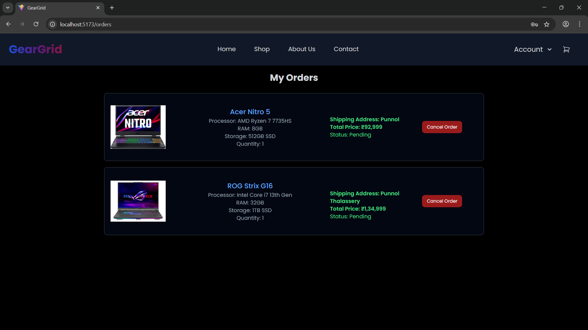

# GearGrid – Ecommerce Laptop Store

**GearGrid** is a full-stack, modern ecommerce platform for buying laptops. Users can customize specifications, see real-time pricing updates, and easily search/filter products. Built with React, Spring Boot, and MySQL, GearGrid demonstrates secure, scalable application architecture.

---

## 🚀 Live Demo

[Try GearGrid Live!](https://geargrid-gaming-laptops.vercel.app/) 

---

## 📝 Executive Summary

GearGrid empowers users to explore, customize, and purchase laptops with ease.  
Admins can manage products, orders, and inventory.  
Key features include dynamic pricing, advanced filtering, and a seamless, responsive UX.

---

## 🛠️ Technologies Used

- **Frontend:** React.js, Tailwind CSS
- **Backend:** Spring Boot (Java), RESTful APIs
- **Database:** MySQL
- **Authentication:** JWT-based, role-based access
- **Deployment:** Frontend (Vercel), Backend (Render using Docker)
- **Dev Tools:** Docker, Postman

---

## 🎯 Key Features

- **Dynamic Pricing:** Laptop prices auto-update based on user-selected specs (RAM, storage, etc.)
- **Normalized Schema:** DB schema is normalized to reduce data redundancy.
- **Advanced Search & Filter:** Find laptops by price, brand, specs, and customer ratings
- **Responsive Design:** Consistent UX across all devices (Tailwind CSS)
- **Role-based Access:** Secure admin/user separation with JWT
- **Admin Dashboard:** Manage inventory, orders, and product catalog
- **Containerized Backend:** Dockerized Spring Boot app for easy deployment and consistency

---

## 🗺️ Architecture Overview

<div align="center">
  
</div>

<details>
<summary><strong>Architecture Explanation</strong> (click to expand)</summary>

- **User (Browser):** Accesses GearGrid via a modern web browser.
- **Frontend (React.js + Tailwind CSS):**  
  - Served as a static site (via Vercel).
  - Communicates securely with the backend API using HTTPS and includes JWT in requests.
- **Backend API (Spring Boot):**  
  - Exposes RESTful endpoints for product management, user authentication, dynamic pricing, filtering/search, and order processing.
  - Performs dynamic pricing adjustments based on selected laptop specifications.
  - Handles role-based access control (admin/user) using JWT tokens.
- **Database (MySQL):**  
  - Stores users, products, orders, inventory, and pricing rules.
- **Authentication (JWT):**  
  - On login, backend issues JWT, which the frontend stores and attaches to API requests.
- **Containerization (Docker):**  
  - Backend is packaged in a Docker container for easy deployment and environment consistency.

</details>

---

## 🗃️ Database Design

<div align="center">
  
</div>

- **Entities:** User, Role, Laptop, LaptopSpec, LaptopColor, SelectedLaptopSpec, CartItem, WishList, Order, OrderItem, EmailSubscription

**Relationships:**

- A **User** can have multiple **Roles** (many-to-many), and a **Role** can be assigned to multiple **Users**.
- A **User** can have multiple **CartItems**, **WishList** entries, and **Orders** (one-to-many relationships).
- Each **CartItem** references a **User**, a **Laptop**, and a **SelectedLaptopSpec** (many-to-one).
- Each **WishList** entry references a **User** and a **Laptop** (many-to-one).
- Each **Order** is placed by a **User** and can contain multiple **OrderItems** (one-to-many with **OrderItem**).
- Each **OrderItem** references an **Order**, a **Laptop**, and a **SelectedLaptopSpec**.
- A **Laptop** can have multiple **LaptopSpecs** (one-to-many), multiple **LaptopColors** (one-to-many), and can be referenced by multiple **CartItems**, **OrderItems**, **WishList** entries, and **SelectedLaptopSpecs**.
- Each **LaptopSpec** and **LaptopColor** references a **Laptop** (many-to-one).
- Each **SelectedLaptopSpec** references a **Laptop** and can be associated with multiple **CartItems** and **OrderItems**.
- **EmailSubscription** stores email addresses for marketing and is not directly linked to other entities.

---

## 🖼️ Screenshots

| Home Page                              | Shopping page                           |
|------------------------------------------|------------------------------------------|
|  |  |

| Laptop Details                         | Orders Page                         |
|------------------------------------------|------------------------------------------|
|  |  |

---

## 💡 Key Learnings & Challenges

- Implemented secure JWT authentication and role-based permissions.
- Designed a flexible, scalable database schema for ecommerce needs.
- Built dynamic pricing logic and efficient filtering/search endpoints.
- Solved CORS, Dockerization, and seamless frontend-backend integration.
- Optimized for responsive design and real-world usability.

---

## 📂 Project Setup

### 1. Clone the Repository
```bash
git clone https://github.com/yourusername/GearGrid.git
cd GearGrid
```

### 2. Setup the Frontend
```bash
cd GearGrid-frontend
npm install
npm run dev
```

### 3. Setup the Backend
```bash
cd GearGrid-Backend
mvn clean install
mvn spring-boot:run
```

---

### Sample Credentials

- **Admin:** admin@geargrid.com / admin123
- **User:** user@geargrid.com / user123

---

## 🔮 Future Scope

- Enable product recommendations.
- Add export/import for orders and inventory (e.g., to CSV/Excel).
- Integrate email notifications for order updates.

---

## 🤝 Contribution / Contact

Feedback and collaboration are welcome!  
Connect with me on [LinkedIn](https://www.linkedin.com/in/sreenand-s-9b2716292/) or email at sreenands93@gmail.com.

---
